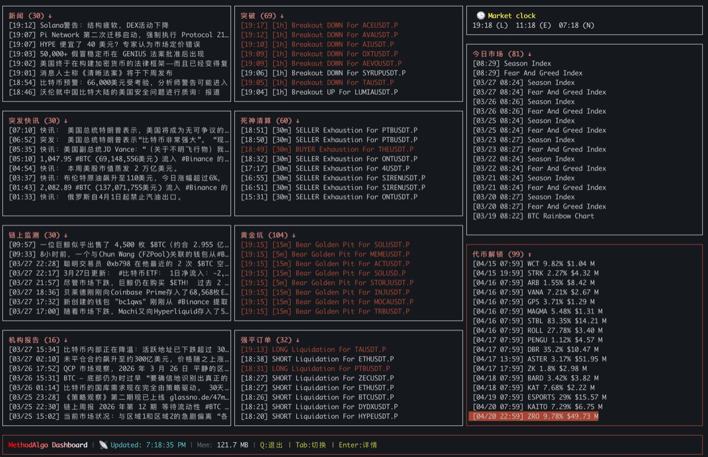

# 🚀 Methodalgo CLI
`methodalgo-cli` is an ultra-fast, professional crypto news and L2 signals terminal based on Node.js. Specially designed for traders and AI agents, it allows users to quickly obtain cryptocurrency market snapshots, news, and signals with deep optimization for LLM workflows.

[English](#english) | [中文](#中文) | [Website](https://www.methodalgo.com)

[](https://opensource.org/licenses/ISC)

[](https://www.npmjs.com/package/methodalgo-cli)
[](https://github.com/methodalgo/methodalgo-cli)


```text
▄▄▄      ▄▄▄             ▄▄             ▄▄   ▄▄▄▄   ▄▄             
████▄  ▄████        ██   ██             ██ ▄██▀▀██▄ ██             
███▀████▀███ ▄█▀█▄ ▀██▀▀ ████▄ ▄███▄ ▄████ ███  ███ ██ ▄████ ▄███▄ 
███  ▀▀  ███ ██▄█▀  ██   ██ ██ ██ ██ ██ ██ ███▀▀███ ██ ██ ██ ██ ██ 
███      ███ ▀█▄▄▄  ██   ██ ██ ▀███▀ ▀████ ███  ███ ██ ▀████ ▀███▀ 
                                                          ██       
                                                        ▀▀▀        
```
---

<a name="english"></a>
## English


### 🚀 Highlights
- 🤖 **AI Friendly**: Clean JSON output, perfect for AI Agentic skills integration.
- ⚡ **Lightning Fast**: Built on Node SEA, millisecond startup time.
- 🖼️ **Terminal Rendering**: Deeply compatible with iTerm2 for previewing snapshots in-terminal.
- 🌍 **Multi-language**: Native support for Chinese and English.


---

### 🛠️ Installation 

####  Recommended: NPM Install
This is the fastest and easiest way to upgrade. Ensure [Node.js](https://nodejs.org/) (v20+) is installed on your system:
```bash
npm install -g methodalgo-cli
methodalgo
```
*Note: this method can auto update when new version released.*

#### 🔑 API Key
To use the CLI, you need an API key. You can create and manage your keys here:
> [**https://account.methodalgo.com/account/api-keys**](https://account.methodalgo.com/account/api-keys)

Once you have your key, run:
```bash
methodalgo login
# Or set via environment variable: export METHODALGO_API_KEY=your_key
```

####  Alternative: Standalone Binary 

No Node.js Required, Download the binary from [Releases](https://github.com/methodalgo/methodalgo-cli/releases). To make it globally accessible:
- **macOS / Linux**: Move the binary to `/usr/local/bin` and rename it to `methodalgo`:
  ```bash
  sudo mv methodalgo-macos-arm64 /usr/local/bin/methodalgo
  sudo chmod +x /usr/local/bin/methodalgo
  methodalgo
  ```
- **Windows**: Add the folder containing `methodalgo-win-x64.exe` to your [System Environment Variables](https://www.google.com/search?q=how+to+add+to+path+windows).

#### Alternative: Install from Source
```bash
git clone https://github.com/methodalgo/methodalgo-cli.git
cd methodalgo-cli
npm install
npm link        # Link local command
methodalgo
```

---
#### 🖥️  Dashboard TUI (`dashboard`)
Launch a real-time TUI (Terminal User Interface) dashboard for a global view of market insights, news, and signals.



*   **Usage**: `methodalgo dashboard` 
*   **Controls**: Use `TAB` to switch panels, `UP/DOWN` to scroll, and `ENTER` to view details.


--- 

### ⚙️ Commands

#### 📸 Market Snapshot (`snapshot`)
Get a real-time TradingView chart snapshot for a specific symbol.

*   **Usage**: `methodalgo snapshot <symbol> [options]`
*   **Options**:
    *   `-t, --tf <timeframe>`: Timeframe (e.g., 1, 15, 60, 4h, D) (Default: "60")
    *   `--json`: Output WebP image URL in JSON format.
    *   `--url`: Force URL output only (do not attempt terminal rendering).

**Example**: `methodalgo snapshot BTCUSDT --json`

**💡 Response Preview**
- **Standard Mode (iTerm2)**: High-definition WebP chart rendered directly in terminal.
- **JSON Mode**: 
```json
{
  "url": "https://m.methodalgo.com/tmp/1774563764359.webp"
}
```

#### 📡 Trading Signals (`signals`)
Fetch the latest Alpha signals or market indices from specified channels.

*   **Usage**: `methodalgo signals [channel] [options]`
*   **Popular Channels**:
    *   `etf-tracker`: Real-time daily inflow/outflow details for BTC/ETH ETFs.
    *   `market-today`: Daily market summary (Fear & Greed Index, Altcoin Season Index, etc.).
    *   `golden-pit-mtf`: High-quality low-frequency pattern recognition signals.
*   **Options**:
    *   `-l, --limit <number>`: Number of signals to fetch (Default: "10")
    *   `--json`: Output raw signals array in JSON format.

**Example**: `methodalgo signals etf-tracker --limit 1`

**💡 Response Preview**
- **List Mode**:
```text
[Index] Title | Content Summary (Publish Time)
    > Detailed data (e.g., ETF net inflow)
    Original: [URL]
```

#### 📰 Market News (`news`)
Get multi-language crypto market news filtered by AI.

*   **Usage**: `methodalgo news [options]`
*   **News Types**: `breaking`, `article`, `onchain`, `report`
*   **Options**:
    *   `-t, --type <type>`: News category (Default: "breaking")
    *   `-l, --limit <number>`: Result count (Default: "10")
    *   `-g, --language <lang>`: Output language (zh/en) (Default: "zh")
    *   `-s, --search <keyword>`: Search keyword in titles.

**Example**: `methodalgo news --type breaking --limit 1 --json`

**💡 Response Preview**
```json
[
  {
    "type": "news",
    "title": { "zh": "突发：...", "en": "JUST IN: ..." },
    "publish_date": "2026-03-26T22:03:49+00:00",
    "url": "https://..."
  }
]
```

```
 
 #### 📅 Economic Calendar (`calendar`)
 Get real-time economic events and macro data.
 
 *   **Usage**: `methodalgo calendar --countries <codes> [options]`
 *   **Options**:
     *   `-c, --countries <codes>`: **(Required)** Comma-separated ISO country codes (e.g., US,EU,JP).
     *   `-f, --from <date>`: ISO start date (Default: 2 days ago) (Format: YYYY-MM-DD).
     *   `-t, --to <date>`: ISO end date (Default: 2 days later) (Format: YYYY-MM-DD).
     *   `--json`: Output raw event data in JSON format.
 
 **Example**: `methodalgo calendar --countries US,EU`
 
 **💡 Response Preview**
 - **List Mode**:
 ```text
 [Index] Date Time [Importance] Country
     Event Title
     Actual: Value | Forecast: Value | Previous: Value
     Source: [Name] [URL]
     Description Summary...
 ```
 
 #### 🏦 Federal Reserve Data (`fred`)
 Access 800,000+ macro economic time series from FRED (Federal Reserve Economic Data).
 
 *   **Usage**: `methodalgo fred [command] [options]`
 *   **Subcommands**:
     *   `dashboard`: Full macro overview (Rates, Inflation, Liquidity, Employment, Conditions).
     *   `recession`: Recession indicator scorecard (6 classic signals based on yield curve, claims, etc.).
     *   `latest <id>`: Get the latest value for a specific series (e.g., `FEDFUNDS`, `UNRATE`, `CPIAUCSL`).
     *   `search <query>`: Search for FRED series by keywords.
     *   `liquidity`: Crypto-relevant net liquidity analysis (Fed Balance Sheet - RRP - TGA).
 *   **Common Series IDs**:
     *   `FEDFUNDS`: Federal Funds Effective Rate
     *   `CPIAUCSL`: Consumer Price Index (CPI)
     *   `GDP`: Gross Domestic Product
     *   `UNRATE`: Unemployment Rate
     *   `WALCL`: Fed Total Assets (Balance Sheet)
     *   `RRPONTSYD`: Reverse Repurchase Agreements (RRP)
 
 **Example**: `methodalgo fred dashboard`
 
 **💡 Response Preview (latest --json)**
 ```json
 {
   "series_id": "FEDFUNDS",
   "title": "Federal Funds Effective Rate",
   "value": 5.33,
   "date": "2026-04-01",
   "units": "Percent"
 }
 ```
 
 #### 🆙 Update Tool (`update`)
Update `methodalgo-cli` to the latest version.

*   **Usage**: `methodalgo update`

---

<a name="中文"></a>
## 中文

### 概览
`methodalgo-cli` 是一个基于 Node.js 开发的极速、专业的加密货币新闻与 L2 信号工具终端。它专为交易者与 AI 代理设计，集成了市场快照、新闻与信号抓取，并针对 LLM 工作流进行了深度优化。

### 亮点

- 🤖 **LLM 友好**: 提供结构清晰的 JSON 输出，完美适配 AI Agent 技能集成。
- ⚡ **极致速度**: 基于 Node SEA 打造，启动毫秒级。
- 🖼️ **终端绘图**: 深度适配 iTerm2，无需离开终端即可预览截图。
- 🌍 **多语言**: 原生支持中英双语切换。

---

### 🛠️ 安装指南

####  推荐：NPM 安装
这是最快速、最易于升级的方式。确保您的系统已安装 [Node.js](https://nodejs.org/) (v20+):
```bash
npm install -g methodalgo-cli
methodalgo
```
*注：此方式在发布新版本时可自动更新。*

#### 🔑 API Key
使用 CLI 需要 API Key。您可以在此处创建和管理您的密钥：
> [**https://account.methodalgo.com/account/api-keys**](https://account.methodalgo.com/account/api-keys)

获取密钥后，请运行：
```bash
methodalgo login
# Or set via environment variable: export METHODALGO_API_KEY=your_key
```

####  其他方式：独立二进制版

无需 Node.js，缺点是包比较大, 直接从 [Releases](https://github.com/methodalgo/methodalgo-cli/releases) 下载对应平台的二进制文件。为了全局调用，建议：
- **macOS / Linux**: 将文件移动到 `/usr/local/bin` 并重命名为 `methodalgo`:
  ```bash
  sudo mv methodalgo-macos-arm64 /usr/local/bin/methodalgo
  sudo chmod +x /usr/local/bin/methodalgo
  methodalgo
  ```
- **Windows**: 将包含 `methodalgo-win-x64.exe` 的文件夹路径添加到系统的 [环境变量 PATH](https://www.baidu.com/s?wd=%E5%A6%82%E4%BD%95%E5%B0%86%E6%96%87%E4%BB%B6%E5%A4%B9%E6%B7%BB%E5%8A%A0%E5%88%B0PATH) 中。

#### 其他方式：源码安装
```bash
git clone https://github.com/methodalgo/methodalgo-cli.git
cd methodalgo-cli
npm install
npm link        # 链接本地指令
methodalgo
```

---

#### 🖥️  Dashboard TUI (`dashboard`)
启动实时 TUI（终端用户界面）仪表盘，全局俯瞰市场洞察、新闻与信号。


*   **用法**: `methodalgo dashboard` 
*   **操作**: 使用 `TAB` 切换面板，`UP/DOWN` 滚动列表，`ENTER` 弹出详情。

---

### ⚙️ 指令指南

#### 📸 市场快照 (`snapshot`)
获取指定交易对的实时 TradingView 图表快照。

*   **用法**: `methodalgo snapshot <symbol> [options]`
*   **选项**:
    *   `-t, --tf <timeframe>`: 时间周期 (如: 1, 15, 60, 4h, D) (默认: "60")
    *   `--json`: 以 JSON 格式输出 WebP 图片 URL。
    *   `--url`: 强制仅输出 URL（不尝试在终端渲染图片）。

**示例**: `methodalgo snapshot BTCUSDT --json`

**💡 响应预览**
- **标准模式 (iTerm2)**: 直接在终端显示高清 WebP 图表。
- **JSON 模式**: 
```json
{
  "url": "https://m.methodalgo.com/tmp/1774563764359.webp"
}
```

#### 📡 交易信号 (`signals`)
从指定频道获取最新的 Alpha 信号或市场指标。

*   **用法**: `methodalgo signals [channel] [options]`
*   **热门频道**:
    *   `etf-tracker`: 监控 BTC/ETH ETF 每日实时资金流入/流出详情。
    *   `market-today`: 每日市场全景总结（包含恐惧贪婪指数、山寨季指数等）。
    *   `golden-pit-mtf`: 低频高质量模式识别信号。
*   **选项**:
    *   `-l, --limit <number>`: 获取信号的数量 (默认: "10")
    *   `--json`: 以 JSON 格式输出原始信号数组。

**示例**: `methodalgo signals etf-tracker --limit 1`

**💡 响应预览**
- **标准模式**:
```text
[序号] 标题 | 核心内容摘要 (发布时间)
    > 详细数据详情 (如 ETF 净流入额)
    查看原文: [URL]
```

#### 📰 市场新闻 (`news`)
获取经过 AI 分选的多语言加密货币市场新闻。

*   **用法**: `methodalgo news [options]`
*   **新闻类型**: `breaking` (快讯), `article` (深度), `onchain` (链上), `report` (报告)
*   **选项**:
    *   `-t, --type <type>`: 新闻分类 (默认: "breaking")
    *   `-l, --limit <number>`: 结果数量 (默认: "10")
    *   `-g, --language <lang>`: 输出语言 (zh/en) (默认: "zh")
    *   `-s, --search <keyword>`: 标题关键词搜索。

**示例**: `methodalgo news --type breaking --limit 1 --json`

**💡 响应预览**
```json
[
  {
    "type": "news",
    "title": { "zh": "突发：...", "en": "JUST IN: ..." },
    "publish_date": "2026-03-26T22:03:49+00:00",
    "url": "https://..."
  }
]
```

 #### 📅 经济日历 (`calendar`)
 获取实时全球经济事件与宏观数据。
 
 *   **用法**: `methodalgo calendar --countries <codes> [options]`
 *   **选项**:
     *   `-c, --countries <codes>`: **(必填)** 逗号分隔的 ISO 国家代码 (例如: US,CN)。
     *   `-f, --from <date>`: ISO 起始日期 (默认: 2 天前) (格式: YYYY-MM-DD)。
     *   `-t, --to <date>`: ISO 截止日期 (默认: 2 天后) (格式: YYYY-MM-DD)。
     *   `--json`: 以 JSON 格式输出原始事件数据。
 
 **示例**: `methodalgo calendar --countries US,CN`
 
 **💡 响应预览**
 - **标准模式**:
 ```text
 [序号] 日期 时间 [重要性] 国家
     事件标题
     实际值: Value | 预测值: Value | 前值: Value
     来源: [名称] [URL]
     事件详情摘要...
 ```
 
 #### 🏦 宏观经济数据 (`fred`)
 接入美联储 FRED 数据库，获取 80 多万条宏观经济时间序列数据。
 
 *   **用法**: `methodalgo fred [command] [options]`
 *   **核心子命令**:
     *   `dashboard`: 宏观经济概览看板 (涵盖利率、通胀、流动性、就业、金融环境)。
     *   `recession`: 衰退指标评分卡 (基于收益率曲线、失业金申请等 6 个经典信号)。
     *   `latest <id>`: 获取特定指标的最新数值 (如 `FEDFUNDS` 利率, `UNRATE` 失业率)。
     *   `search <query>`: 通过关键词搜索经济指标。
     *   `liquidity`: 加密货币相关净流动性分析 (美联储资产负债表 - 逆回购 - TGA)。
 *   **常用指标 ID**:
     *   `FEDFUNDS`: 联邦基金有效利率
     *   `CPIAUCSL`: 消费者价格指数 (CPI)
     *   `GDP`: 国内生产总值
     *   `UNRATE`: 失业率
     *   `WALCL`: 美联储总资产 (资产负债表)
     *   `RRPONTSYD`: 隔夜逆回购 (RRP)
 
 **示例**: `methodalgo fred dashboard`
 
 **💡 响应预览 (latest --json)**
 ```json
 {
   "series_id": "FEDFUNDS",
   "title": "Federal Funds Effective Rate",
   "value": 5.33,
   "date": "2026-04-01",
   "units": "百分比"
 }
 ```
 
 #### 🆙 更新工具 (`update`)
将 `methodalgo-cli` 更新至最新版本。

*   **用法**: `methodalgo update`

---

*Powered by Methodalgo.*

#### ⚙️ Environment Variables

You can use environment variables to configure the CLI. Environment variables take precedence over local configuration files.

| Variable | Description |
| --- | --- |
| `METHODALGO_API_KEY` | Your Methodalgo API Key. |
| `METHODALGO_API_BASE` | Custom API base URL (Default: `https://api.methodalgo.com`). |


#### ⚙️ 环境变量

您可以使用环境变量来配置 CLI。环境变量的优先级高于本地配置文件。

| 变量名 | 描述 |
| --- | --- |
| `METHODALGO_API_KEY` | 您的 Methodalgo API Key。 |
| `METHODALGO_API_BASE` | 自定义 API 基础 URL（默认：`https://api.methodalgo.com`）。 |

