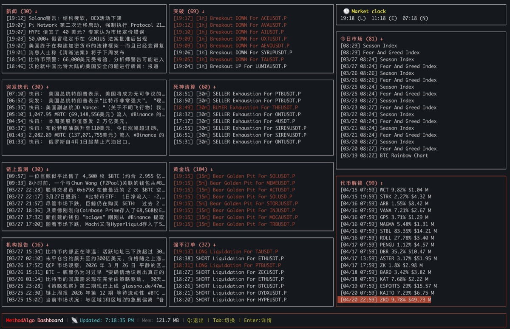

# 🚀 Methodalgo CLI
`methodalgo-cli` is an ultra-fast, professional crypto news and L2 signals terminal based on Node.js. Specially designed for traders and AI agents, it allows users to quickly obtain cryptocurrency market snapshots, news, and signals with deep optimization for LLM workflows.

[English](#english) | [中文](#中文) | [Website](https://www.methodalgo.com)

[](https://opensource.org/licenses/ISC)

[](https://www.npmjs.com/package/methodalgo-cli)
[](https://github.com/methodalgo/methodalgo-cli)


```text
▄▄▄      ▄▄▄             ▄▄             ▄▄   ▄▄▄▄   ▄▄             
████▄  ▄████        ██   ██             ██ ▄██▀▀██▄ ██             
███▀████▀███ ▄█▀█▄ ▀██▀▀ ████▄ ▄███▄ ▄████ ███  ███ ██ ▄████ ▄███▄ 
███  ▀▀  ███ ██▄█▀  ██   ██ ██ ██ ██ ██ ██ ███▀▀███ ██ ██ ██ ██ ██ 
███      ███ ▀█▄▄▄  ██   ██ ██ ▀███▀ ▀████ ███  ███ ██ ▀████ ▀███▀ 
                                                          ██       
                                                        ▀▀▀        
```
---

<a name="english"></a>
## English


### 🚀 Highlights
- 🤖 **AI Friendly**: Clean JSON output, perfect for AI Agentic skills integration.
- ⚡ **Lightning Fast**: Built on Node SEA, millisecond startup time.
- 🖼️ **Terminal Rendering**: Deeply compatible with iTerm2 for previewing snapshots in-terminal.
- 🌍 **Multi-language**: Native support for Chinese and English.


---

### 🛠️ Installation 

####  Recommended: NPM Install
This is the fastest and easiest way to upgrade. Ensure [Node.js](https://nodejs.org/) (v20+) is installed on your system:
```bash
npm install -g methodalgo-cli
methodalgo
```
*Note: this method can auto update when new version released.*

#### 🔑 Login / API Key
To use the CLI, run browser login. The account service will reuse or create a dedicated `methodalgo-cli:` API key and save it locally after validation.
> [**https://account.methodalgo.com/account/api-keys**](https://account.methodalgo.com/account/api-keys)

Run:
```bash
methodalgo login
methodalgo login --api-key # fallback: paste an API Key manually
# Or set via environment variable: export METHODALGO_API_KEY=your_key
```

####  Alternative: Standalone Binary 

No Node.js Required, Download the binary from [Releases](https://github.com/methodalgo/methodalgo-cli/releases). To make it globally accessible:
- **macOS / Linux**: Move the binary to `/usr/local/bin` and rename it to `methodalgo`:
  ```bash
  sudo mv methodalgo-macos-arm64 /usr/local/bin/methodalgo
  sudo chmod +x /usr/local/bin/methodalgo
  methodalgo
  ```
- **Windows**: Add the folder containing `methodalgo-win-x64.exe` to your [System Environment Variables](https://www.google.com/search?q=how+to+add+to+path+windows).

#### Alternative: Install from Source
```bash
git clone https://github.com/methodalgo/methodalgo-cli.git
cd methodalgo-cli
npm install
npm link        # Link local command
methodalgo
```

---
#### 🖥️  Dashboard TUI (`dashboard`)
Launch a real-time TUI (Terminal User Interface) dashboard for a global view of market insights, news, and signals.



*   **Usage**: `methodalgo dashboard` 
*   **Controls**: Use `TAB` to switch panels, `UP/DOWN` to scroll, and `ENTER` to view details.
*   **Live updates**: The dashboard loads an aggregated snapshot first, then keeps news and signal panels fresh through a server-side stream. If streaming is unavailable, it automatically falls back to grouped polling.
*   **Watchlist**: Use `methodalgo dashboard --watchlist BTC,ETH,SOL` to highlight matching news and signal rows.


--- 

### ⚙️ Commands

#### 📸 Market Snapshot (`snapshot`)
Get a real-time TradingView chart snapshot for a specific symbol.

*   **Usage**: `methodalgo snapshot <symbol> [options]`
*   **Options**:
    *   `-t, --tf <timeframe>`: Timeframe (e.g., 1, 15, 60, 4h, D) (Default: "60")
    *   `--json`: Output WebP image URL in JSON format.
    *   `--url`: Force URL output only (do not attempt terminal rendering).

**Example**: `methodalgo snapshot BTCUSDT --json`

**💡 Response Preview**
- **Standard Mode (iTerm2)**: High-definition WebP chart rendered directly in terminal.
- **JSON Mode**: 
```json
{
  "url": "https://m.methodalgo.com/tmp/1774563764359.webp"
}
```

#### 📡 Trading Signals (`signals`)
Fetch Alpha signals or market indices. Optimized for real-time tracking.

*   **Usage**: `methodalgo signals [channel] [options]`
*   **Key Channels**:
    *   `breakout-htf/mtf`: 100-candle rolling window high/low breakout alerts.
    *   `exhaustion-buyer/seller`: Reversal signals based on Grim Reaper Heatmap.
    *   `etf-tracker`: Real-time daily inflow/outflow details for BTC/ETH/SOL ETFs.
    *   `market-today`: Daily summary (Fear & Greed, Alt Season Index).
    *   `golden-pit-mtf`: "Smart Cloud" pump/dump pattern recognition.
    *   `token-unlock`: Countdown and details for upcoming token unlocks.
*   **Options**:
    *   `-l, --limit <number>`: Number of signals to fetch (Default: "10").
    *   `-a, --after <id>`: Fetch signals after a specific Message ID (for incremental sync).
    *   `--json`: Output raw signals array in JSON format.

**Example**: `methodalgo signals breakout-mtf --limit 5`

#### 📰 Market News (`news`)
Get multi-language crypto market news filtered by AI.

*   **Usage**: `methodalgo news [options]`
*   **News Types**: `breaking`, `article`, `onchain`, `report`
*   **Options**:
    *   `-t, --type <type>`: News category (Default: "breaking")
    *   `-l, --limit <number>`: Result count (Default: "10")
    *   `-g, --language <lang>`: Output language (zh/en) (Default: "zh")
    *   `-s, --search <keyword>`: Search keyword in titles.

**Example**: `methodalgo news --type breaking --limit 1 --json`

**💡 Response Preview**
```json
[
  {
    "type": "news",
    "title": { "zh": "突发：...", "en": "JUST IN: ..." },
    "publish_date": "2026-03-26T22:03:49+00:00",
    "url": "https://..."
  }
]
```

#### 📅 Economic Calendar (`calendar`)
 Get real-time global economic events and macro data.
 
 *   **Usage**: `methodalgo calendar --countries <codes> [options]`
 *   **Options**:
     *   `-c, --countries <codes>`: **(Required)** Comma-separated ISO codes (e.g., `US,EU,JP`).
     *   `-f, --from <date>`: Start date (YYYY-MM-DD). Default: 2 days ago.
     *   `-t, --to <date>`: End date (YYYY-MM-DD). Default: 2 days later.
     *   `--json`: Output raw event data in JSON format.
 
 **Example**: `methodalgo calendar --countries US,CN`
 
 #### 🏦 Federal Reserve Data (`fred`)
 Access 800,000+ macro economic time series from FRED (Federal Reserve Economic Data).
 
 *   **Usage**: `methodalgo fred [command] [options]`
 *   **Subcommands**:
     *   `dashboard`: Full macro overview (Rates, Inflation, Liquidity, Employment, Conditions).
     *   `recession`: Recession indicator scorecard (6 classic signals based on yield curve, claims, etc.).
     *   `liquidity`: Crypto-relevant net liquidity analysis (Fed Balance Sheet - RRP - TGA).
     *   `latest <id>`: Get the latest value for a specific series.
     *   `search <query>`: Search for FRED series by keywords.
     *   `compare <ids>`: Compare multiple series (e.g., `methodalgo fred compare GS10,GS2`).
     *   `changes <id>`: Show recent changes and trends for a series.
     *   `spread <id1,id2>`: Compute the difference between two series (e.g., 10Y-2Y spread).
     *   `zscore <id>`: Statistical Z-score and percentile analysis vs historical data.
 *   **Options**:
     *   `-b, --lookback <window>`: Lookback window (e.g., `5y`, `24m`, `365d`).
     *   `-n, --tail <number>`: Show last N observations.
 *   **Common Series IDs**:
     *   `FEDFUNDS`: Fed Funds Rate | `CPIAUCSL`: Consumer Price Index (CPI)
     *   `WALCL`: Fed Total Assets | `RRPONTSYD`: Reverse Repo (RRP)
     *   `T10Y2Y`: 10-Year vs 2-Year Treasury Spread
 
 **Example**: `methodalgo fred liquidity --m2`

**💡 Pro Tip**: You can get your own FRED API Key from [St. Louis Fed](https://fred.stlouisfed.org/docs/api/api_key.html) and set it via:
 `methodalgo config set fred-api-key <your-key>`

#### 🟡 Binance Market Data (`binance`)
Access Binance spot and USD-M futures public market data without an API key.

*   **Usage**: `methodalgo binance [command] [options]`
*   **Symbol convention**:
    *   `BTCUSDT` queries spot data by default.
    *   `BTCUSDT.P` queries USD-M perpetual futures data by default.
    *   `--market auto|spot|futures` is available where supported. `auto` uses the symbol suffix; explicit `spot` or `futures` overrides the suffix and sends the normalized Binance symbol (for example, `BTCUSDT.P` becomes `BTCUSDT`).
    *   Futures-only commands (`funding`, `oi`, `sentiment`, `basis`) always query USD-M futures. `BTCUSDT` and `BTCUSDT.P` both resolve to the same futures symbol.
*   **Subcommands**:
    *   `price <symbol>`: Latest price, 24h change, high/low, and quote volume (`BTCUSDT` = spot, `BTCUSDT.P` = futures).
    *   `ticker [symbol]`: 24h ticker statistics for one symbol or high-volume USDT pairs. Without a symbol it defaults to spot unless `--market futures` is provided. `--limit` limits table output; `--json` returns the raw Binance response.
    *   `movers`: 24h gainers and losers for spot or futures. Use `--market futures` for USD-M futures movers.
    *   `book <symbol>`: Order book depth for spot or futures based on symbol suffix.
    *   `trades <symbol>`: Recent market trades for spot or futures based on symbol suffix.
    *   `klines <symbol>`: OHLCV candlesticks for spot or futures based on symbol suffix.
    *   `funding <symbol>`: Futures funding rate and mark/index price.
    *   `oi <symbol>`: Futures open interest and recent OI history.
    *   `sentiment <symbol>`: Futures long/short ratios and taker buy/sell ratio.
    *   `basis <symbol>`: Futures basis and basis rate.
    *   `exchange-info [symbol]`: Symbol rules and exchange metadata.
    *   `raw <path>`: Allowlisted public endpoint passthrough. It only supports public endpoints that do not require API keys; account, order, trading, and signed endpoints are intentionally blocked.
*   **Options**:
    *   `-m, --market <auto|spot|futures>`: Select automatic symbol inference, spot, or USD-M futures where supported.
    *   `--json`: Output raw JSON for agents and scripts. For most commands this is the direct Binance response, not the formatted table.

**Examples**:
`methodalgo binance klines BTCUSDT --interval 15m`
`methodalgo binance klines BTCUSDT.P --interval 15m`
`methodalgo binance movers --market futures --limit 10`
 
 #### 🆙 Update Tool (`update`)
Update `methodalgo-cli` to the latest version.

*   **Usage**: `methodalgo update`

---

<a name="中文"></a>
## 中文

### 概览
`methodalgo-cli` 是一个基于 Node.js 开发的极速、专业的加密货币新闻与 L2 信号工具终端。它专为交易者与 AI 代理设计，集成了市场快照、新闻与信号抓取，并针对 LLM 工作流进行了深度优化。

### 亮点

- 🤖 **LLM 友好**: 提供结构清晰的 JSON 输出，完美适配 AI Agent 技能集成。
- ⚡ **极致速度**: 基于 Node SEA 打造，启动毫秒级。
- 🖼️ **终端绘图**: 深度适配 iTerm2，无需离开终端即可预览截图。
- 🌍 **多语言**: 原生支持中英双语切换。

---

### 🛠️ 安装指南

####  推荐：NPM 安装
这是最快速、最易于升级的方式。确保您的系统已安装 [Node.js](https://nodejs.org/) (v20+):
```bash
npm install -g methodalgo-cli
methodalgo
```
*注：此方式在发布新版本时可自动更新。*

#### 🔑 登录 / API Key
使用 CLI 时请先运行浏览器登录。账户服务会复用或创建一个专用的 `methodalgo-cli:` API Key，并在验证通过后保存到本地。
> [**https://account.methodalgo.com/account/api-keys**](https://account.methodalgo.com/account/api-keys)

运行：
```bash
methodalgo login
methodalgo login --api-key # 回退方案：手动粘贴 API Key
# Or set via environment variable: export METHODALGO_API_KEY=your_key
```

####  其他方式：独立二进制版

无需 Node.js，缺点是包比较大, 直接从 [Releases](https://github.com/methodalgo/methodalgo-cli/releases) 下载对应平台的二进制文件。为了全局调用，建议：
- **macOS / Linux**: 将文件移动到 `/usr/local/bin` 并重命名为 `methodalgo`:
  ```bash
  sudo mv methodalgo-macos-arm64 /usr/local/bin/methodalgo
  sudo chmod +x /usr/local/bin/methodalgo
  methodalgo
  ```
- **Windows**: 将包含 `methodalgo-win-x64.exe` 的文件夹路径添加到系统的 [环境变量 PATH](https://www.baidu.com/s?wd=%E5%A6%82%E4%BD%95%E5%B0%86%E6%96%87%E4%BB%B6%E5%A4%B9%E6%B7%BB%E5%8A%A0%E5%88%B0PATH) 中。

#### 其他方式：源码安装
```bash
git clone https://github.com/methodalgo/methodalgo-cli.git
cd methodalgo-cli
npm install
npm link        # 链接本地指令
methodalgo
```

---

#### 🖥️  Dashboard TUI (`dashboard`)
启动实时 TUI（终端用户界面）仪表盘，全局俯瞰市场洞察、新闻与信号。


*   **用法**: `methodalgo dashboard` 
*   **操作**: 使用 `TAB` 切换面板，`UP/DOWN` 滚动列表，`ENTER` 弹出详情。
*   **实时更新**: 仪表盘会先加载聚合快照，然后通过服务端流式通道刷新新闻与信号面板；如果流式通道不可用，会自动回退到分组轮询。
*   **关注列表**: 使用 `methodalgo dashboard --watchlist BTC,ETH,SOL` 高亮匹配的新闻与信号行。

---

### ⚙️ 指令指南

#### 📸 市场快照 (`snapshot`)
获取指定交易对的实时 TradingView 图表快照。

*   **用法**: `methodalgo snapshot <symbol> [options]`
*   **选项**:
    *   `-t, --tf <timeframe>`: 时间周期 (如: 1, 15, 60, 4h, D) (默认: "60")
    *   `--json`: 以 JSON 格式输出 WebP 图片 URL。
    *   `--url`: 强制仅输出 URL（不尝试在终端渲染图片）。

**示例**: `methodalgo snapshot BTCUSDT --json`

**💡 响应预览**
- **标准模式 (iTerm2)**: 直接在终端显示高清 WebP 图表。
- **JSON 模式**: 
```json
{
  "url": "https://m.methodalgo.com/tmp/1774563764359.webp"
}
```

#### 📡 交易信号 (`signals`)
获取 Alpha 信号或市场指标。针对实时追踪进行了深度优化。

*   **用法**: `methodalgo signals [channel] [options]`
*   **核心频道**:
    *   `breakout-htf/mtf`: 100 根 K 线滚动窗口的高/低点突破提醒。
    *   `exhaustion-buyer/seller`: 基于死神清算热力图的反转信号。
    *   `etf-tracker`: BTC/ETH/SOL ETF 每日实时资金流入/流出详情。
    *   `market-today`: 每日总结（恐惧贪婪指数、山寨季指数）。
    *   `golden-pit-mtf`: "Smart Cloud" 模式识别（拉升/砸盘预警）。
    *   `token-unlock`: 即将到来的代币解锁倒计时与详情。
*   **选项**:
    *   `-l, --limit <number>`: 获取信号的数量 (默认: "10")。
    *   `-a, --after <id>`: 获取指定消息 ID 之后的信号 (用于增量同步)。
    *   `--json`: 以 JSON 格式输出原始信号数组。

**示例**: `methodalgo signals breakout-mtf --limit 5`

#### 📰 市场新闻 (`news`)
获取经过 AI 分选的多语言加密货币市场新闻。

*   **用法**: `methodalgo news [options]`
*   **新闻类型**: `breaking` (快讯), `article` (深度), `onchain` (链上), `report` (报告)
*   **选项**:
    *   `-t, --type <type>`: 新闻分类 (默认: "breaking")
    *   `-l, --limit <number>`: 结果数量 (默认: "10")
    *   `-g, --language <lang>`: 输出语言 (zh/en) (默认: "zh")
    *   `-s, --search <keyword>`: 标题关键词搜索。

**示例**: `methodalgo news --type breaking --limit 1 --json`

**💡 响应预览**
```json
[
  {
    "type": "news",
    "title": { "zh": "突发：...", "en": "JUST IN: ..." },
    "publish_date": "2026-03-26T22:03:49+00:00",
    "url": "https://..."
  }
]
```

 #### 📅 经济日历 (`calendar`)
 获取实时全球经济事件与宏观数据。
 
 *   **用法**: `methodalgo calendar --countries <codes> [options]`
 *   **选项**:
     *   `-c, --countries <codes>`: **(必填)** 逗号分隔的 ISO 国家代码 (例如: `US,EU,JP`)。
     *   `-f, --from <date>`: 起始日期 (YYYY-MM-DD)。默认: 2 天前。
     *   `-t, --to <date>`: 截止日期 (YYYY-MM-DD)。默认: 2 天后。
     *   `--json`: 以 JSON 格式输出原始事件数据。
 
 **示例**: `methodalgo calendar --countries US,CN`
 
 #### 🏦 宏观经济数据 (`fred`)
 接入美联储 FRED 数据库，获取 80 多万条宏观经济时间序列数据。
 
 *   **用法**: `methodalgo fred [command] [options]`
 *   **核心子命令**:
     *   `dashboard`: 宏观经济概览看板 (涵盖利率、通胀、流动性、就业、金融环境)。
     *   `recession`: 衰退指标评分卡 (基于收益率曲线、失业金申请等 6 个经典信号)。
     *   `liquidity`: 加密货币相关净流动性分析 (美联储资产负债表 - 逆回购 - TGA)。
     *   `latest <id>`: 获取特定指标的最新数值。
     *   `search <query>`: 通过关键词搜索经济指标。
     *   `compare <ids>`: 对比多个指标 (例如: `methodalgo fred compare GS10,GS2`)。
     *   `changes <id>`: 查看指标的近期变化和趋势。
     *   `spread <id1,id2>`: 计算两个指标之间的利差 (如 10Y-2Y 利差)。
     *   `zscore <id>`: 统计学 Z-Score 分析及当前值在历史中的百分位。
 *   **常用选项**:
     *   `-b, --lookback <window>`: 回溯窗口 (如: `5y`, `24m`, `365d`)。
     *   `-n, --tail <number>`: 显示最后 N 条记录。
 *   **常用指标 ID**:
     *   `FEDFUNDS`: 联邦基金利率 | `CPIAUCSL`: 消费者价格指数 (CPI)
     *   `WALCL`: 美联储总资产 | `RRPONTSYD`: 隔夜逆回购 (RRP)
     *   `T10Y2Y`: 10年期与2年期美债利差
 
 **示例**: `methodalgo fred dashboard`
 
**💡 专业提示**: 您可以从 [圣路易斯联储官网](https://fred.stlouisfed.org/docs/api/api_key.html) 获取您自己的 FRED API Key，并通过以下指令设置：
 `methodalgo config set fred-api-key <your-key>`

#### 🟡 币安市场数据 (`binance`)
无需 API Key，直接查询币安现货与 U 本位合约公开市场数据。

*   **用法**: `methodalgo binance [command] [options]`
*   **Symbol 约定**:
    *   `BTCUSDT` 默认查询现货数据。
    *   `BTCUSDT.P` 默认查询 U 本位永续合约数据。
    *   `--market auto|spot|futures` 可在支持的命令中使用。`auto` 按 symbol 后缀推断；显式传入 `spot` 或 `futures` 会覆盖后缀，并发送标准化后的 Binance symbol（例如 `BTCUSDT.P` 会变成 `BTCUSDT`）。
    *   合约专属命令（`funding`、`oi`、`sentiment`、`basis`）始终查询 U 本位合约。`BTCUSDT` 和 `BTCUSDT.P` 在这些命令中会解析到同一个合约交易对。
*   **核心子命令**:
    *   `price <symbol>`: 最新价格、24h 涨跌、高低点与成交额 (`BTCUSDT` = 现货，`BTCUSDT.P` = 合约)。
    *   `ticker [symbol]`: 单交易对或高成交额 USDT 交易对的 24h 行情。不传 symbol 时默认查现货列表，传 `--market futures` 时查合约列表。`--limit` 限制表格输出；`--json` 返回 Binance 原始响应。
    *   `movers`: 现货或合约 24h 涨幅榜与跌幅榜。使用 `--market futures` 查询 U 本位合约榜单。
    *   `book <symbol>`: 按 symbol 后缀查询现货或合约盘口深度。
    *   `trades <symbol>`: 按 symbol 后缀查询现货或合约最近成交。
    *   `klines <symbol>`: 按 symbol 后缀查询现货或合约 OHLCV K 线。
    *   `funding <symbol>`: 合约资金费率、标记价与指数价。
    *   `oi <symbol>`: 合约当前持仓量与近期 OI 历史。
    *   `sentiment <symbol>`: 合约多空比与主动买卖量。
    *   `basis <symbol>`: 合约基差与基差率。
    *   `exchange-info [symbol]`: 交易对规则与交易所元数据。
    *   `raw <path>`: 白名单内公开 endpoint 透传。仅支持无需 API Key 的公开接口；账户、订单、交易和签名接口会被阻止。
*   **常用选项**:
    *   `-m, --market <auto|spot|futures>`: 在支持的命令中选择自动推断、现货或 U 本位合约。
    *   `--json`: 输出原始 JSON，便于 AI 代理和脚本解析。多数命令会直接返回 Binance 原始响应，而不是格式化表格。

**示例**:
`methodalgo binance klines BTCUSDT --interval 15m`
`methodalgo binance klines BTCUSDT.P --interval 15m`
`methodalgo binance movers --market futures --limit 10`
 
 #### 🆙 更新工具 (`update`)
将 `methodalgo-cli` 更新至最新版本。

*   **用法**: `methodalgo update`

---

*Powered by Methodalgo.*

#### ⚙️ Environment Variables

You can use environment variables to configure the CLI. Environment variables take precedence over local configuration files.

| Variable | Description |
| --- | --- |
| `METHODALGO_API_KEY` | Your Methodalgo API Key. |
| `METHODALGO_ACCOUNT_BASE` | Custom account URL for OAuth login (Default: `https://account.methodalgo.com`). |
| `METHODALGO_API_BASE` | Custom API base URL (Default: `https://api.methodalgo.com`). |


#### ⚙️ 环境变量

您可以使用环境变量来配置 CLI。环境变量的优先级高于本地配置文件。

| 变量名 | 描述 |
| --- | --- |
| `METHODALGO_API_KEY` | 您的 Methodalgo API Key。 |
| `METHODALGO_ACCOUNT_BASE` | 自定义 OAuth 登录账户地址（默认：`https://account.methodalgo.com`）。 |
| `METHODALGO_API_BASE` | 自定义 API 基础 URL（默认：`https://api.methodalgo.com`）。 |
